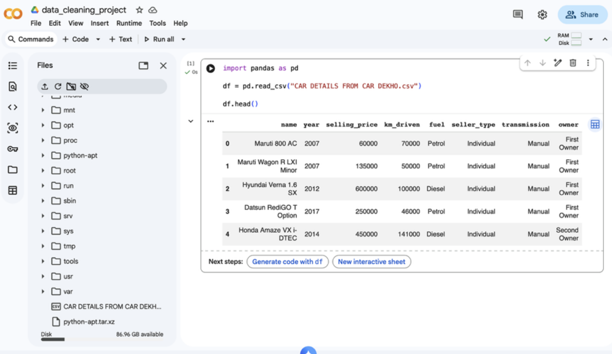
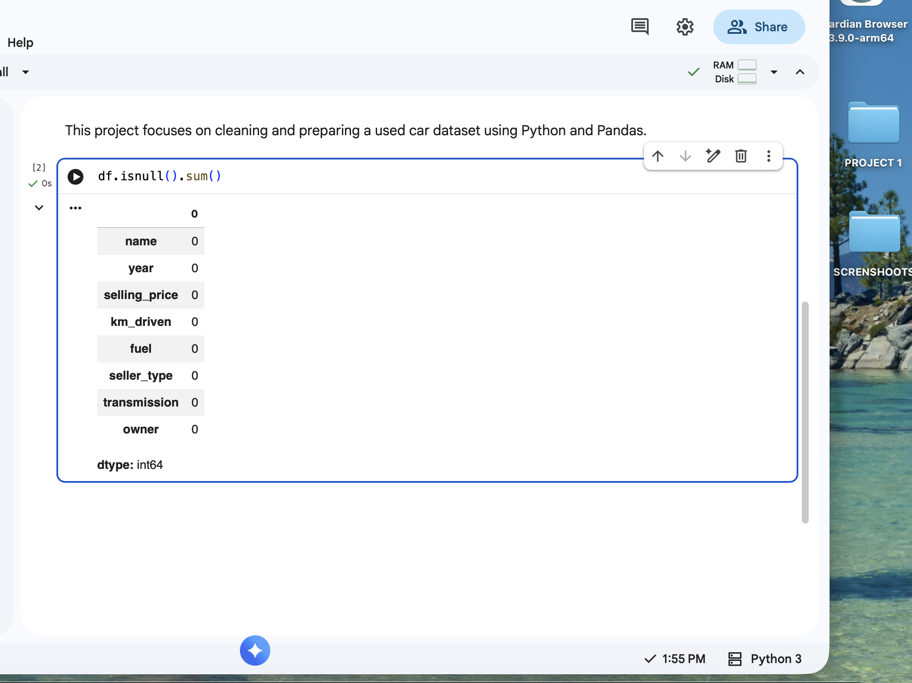
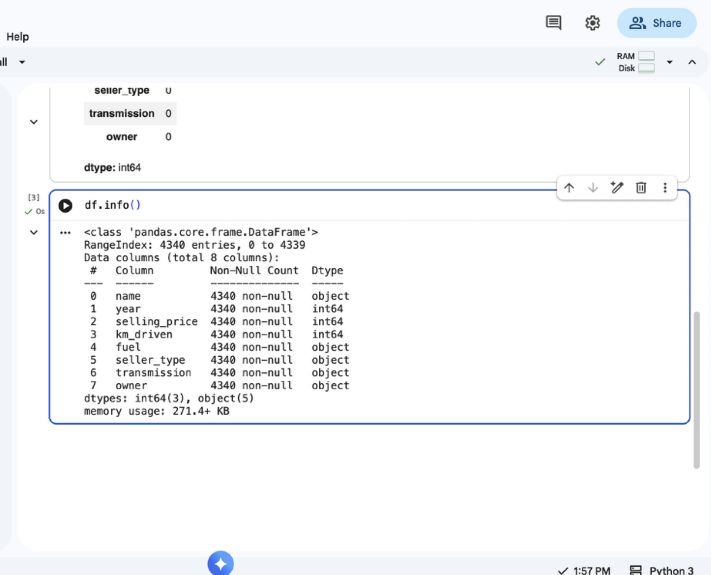
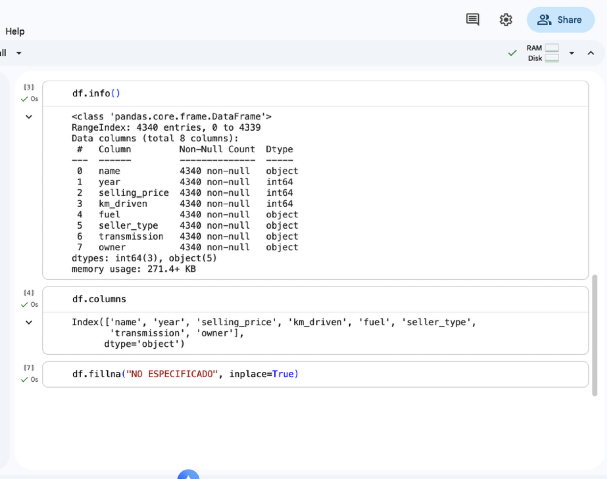
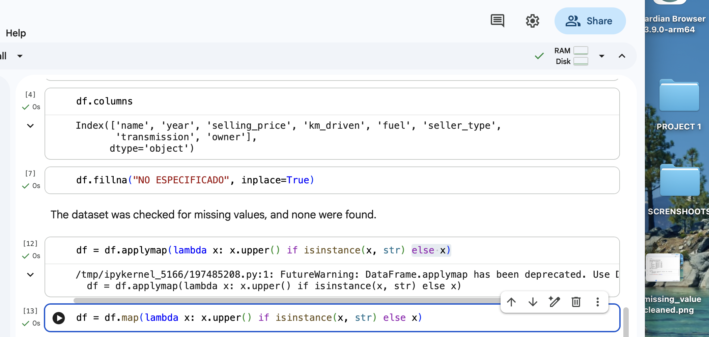
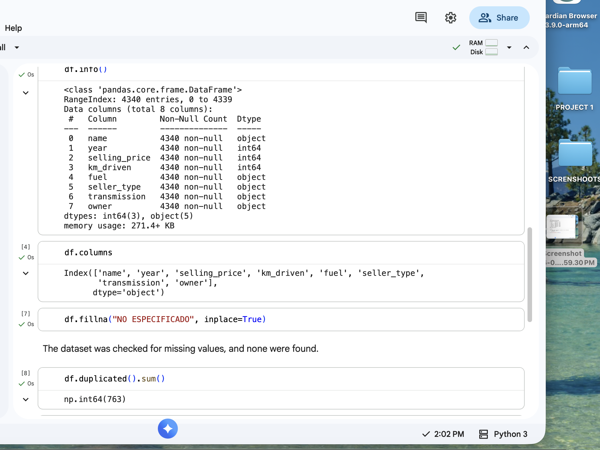
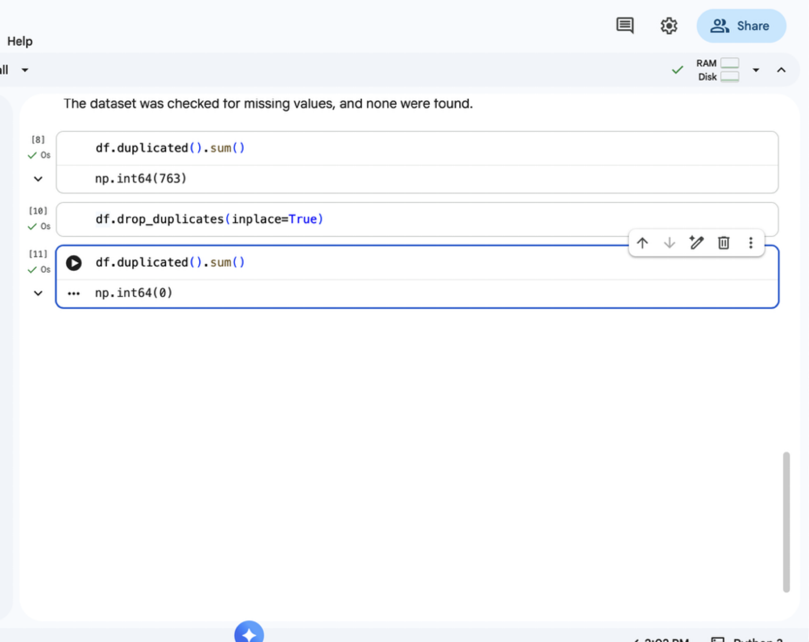
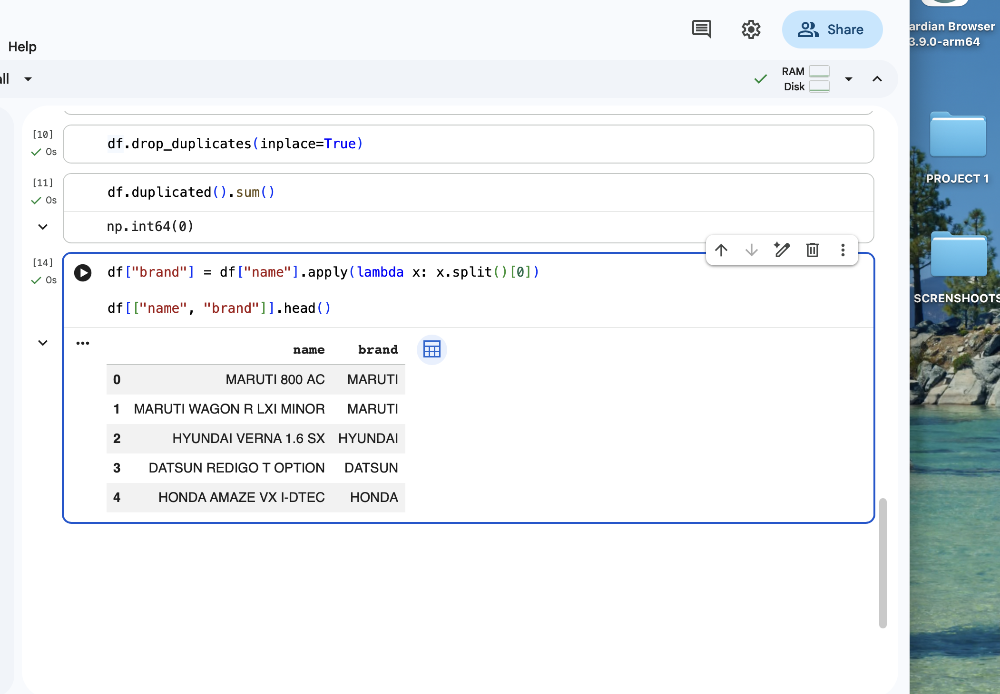
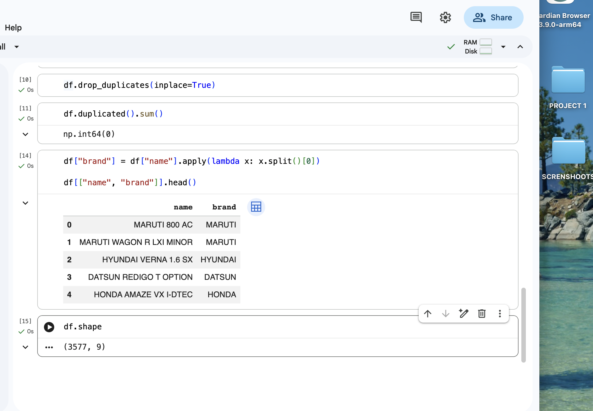

# Project 1: Data Cleaning and Transformation

## Overview
This project focuses on cleaning and preparing a used car dataset using Python and Pandas. The objective is to improve data quality and prepare the dataset for further analysis.

---

## Dataset
- Source: Car Dekho dataset  
- Initial Records: 4,340 rows  
- Final Records: 3,577 rows (after cleaning)

---

## Cleaning Process

### 1. Data Exploration
- Loaded dataset using Pandas
- Reviewed structure using `df.info()` and `df.columns`

### 2. Missing Values
- Checked for missing values using `df.isnull().sum()`
- No missing values were found in the dataset

### 3. Data Standardization
- Converted all text values to uppercase for consistency

### 4. Duplicate Removal
- Identified 763 duplicate records
- Removed duplicates to ensure data accuracy

### 5. Feature Engineering
- Created a new column **brand** from the car name
- Extracted brand names to enhance data usability

---

## Results
- Clean dataset with no duplicates
- Standardized text format
- Added new feature (brand column)
- Improved dataset structure and usability

---

## Tools Used
- Python
- Pandas
- Google Colab

---

## Preview

### Raw Data

### Missing Values Check

### Dataset Structure

### Missing Values Cleaned

### Uppercase Transformation

### Duplicates Before Removal

### Duplicates Removed

### Brand Extraction

### Final Dataset Shape

